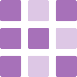

Kodo
====

|Linux make-specs| |Windows make-specs| |MacOS make-specs| |Linux CMake| |Windows CMake| |MacOS CMake| |Raspberry Pi| |CMake Examples| |Valgrind| |No Assertions| |Clang Format| |Cppcheck|

.. |Linux make-specs| image:: https://github.com/steinwurf/kodo/actions/workflows/linux_mkspecs.yml/badge.svg
   :target: https://github.com/steinwurf/kodo/actions/workflows/linux_mkspecs.yml

.. |Windows make-specs| image:: https://github.com/steinwurf/kodo/actions/workflows/windows_mkspecs.yml/badge.svg
   :target: https://github.com/steinwurf/kodo/actions/workflows/windows_mkspecs.yml

.. |MacOS make-specs| image:: https://github.com/steinwurf/kodo/actions/workflows/macos_mkspecs.yml/badge.svg
   :target: https://github.com/steinwurf/kodo/actions/workflows/macos_mkspecs.yml

.. |Linux CMake| image:: https://github.com/steinwurf/kodo/actions/workflows/linux_cmake.yml/badge.svg
   :target: https://github.com/steinwurf/kodo/actions/workflows/linux_cmake.yml

.. |Windows CMake| image:: https://github.com/steinwurf/kodo/actions/workflows/windows_cmake.yml/badge.svg
   :target: https://github.com/steinwurf/kodo/actions/workflows/windows_cmake.yml

.. |MacOS CMake| image:: https://github.com/steinwurf/kodo/actions/workflows/macos_cmake.yml/badge.svg
   :target: https://github.com/steinwurf/kodo/actions/workflows/macos_cmake.yml

.. |Raspberry Pi| image:: https://github.com/steinwurf/kodo/actions/workflows/raspberry_pi.yml/badge.svg
   :target: https://github.com/steinwurf/kodo/actions/workflows/raspberry_pi.yml

.. |CMake Examples| image:: https://github.com/steinwurf/kodo/actions/workflows/cmake_examples.yml/badge.svg
   :target: https://github.com/steinwurf/kodo/actions/workflows/cmake_examples.yml

.. |Clang Format| image:: https://github.com/steinwurf/kodo/actions/workflows/clang-format.yml/badge.svg
   :target: https://github.com/steinwurf/kodo/actions/workflows/clang-format.yml

.. |No Assertions| image:: https://github.com/steinwurf/kodo/actions/workflows/nodebug.yml/badge.svg
   :target: https://github.com/steinwurf/kodo/actions/workflows/nodebug.yml

.. |Valgrind| image:: https://github.com/steinwurf/kodo/actions/workflows/valgrind.yml/badge.svg
   :target: https://github.com/steinwurf/kodo/actions/workflows/valgrind.yml

.. |Cppcheck| image:: https://github.com/steinwurf/kodo/actions/workflows/cppcheck.yml/badge.svg
   :target: https://github.com/steinwurf/kodo/actions/workflows/cppcheck.yml

Kodo is a flexible C++ network coding library, intended to be used for
commercial applications and research on implementation of Network
Coding.

The examples folder contains some example applications showing the usage of the
API.

Documentation can be found here:

* `Latest <https://kodo.steinwurf.com/docs/latest>`_.
* `Stable <https://kodo.steinwurf.com/docs/stable>`_.
