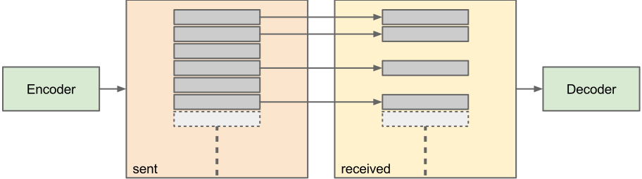

Simulating Losses
-----------------

In this example we will expand the previous basic example by
simulating some loss of the encoded data.  This can be done simply by
not "transmitting" encoded symbol to the decoder. 
The complete example is shown below.

.. literalinclude:: ../../examples/tutorial/block_add_loss.cpp
    :language: c++
    :linenos:
    :lines: 20-

As the attentive reader might notice, only the coding loop is changed
from the basic example.

.. literalinclude:: ../../examples/tutorial/block_add_loss.cpp
    :language: c++
    :start-after: //! [0]
    :end-before: //! [1]
    :linenos:

The change is fairly simple. We introduce a 50% loss using ``rand() %
2`` and add a variable ``dropped_count`` to keep track of the dropped
symbols.

The encoder can, in theory, create an infinite number of coded symbols,
since RLNC is a rateless code. This means that as long as the loss rate is
below 100% the decoder will at some point be able to finish the decoding.

A graphical representation of the setup is seen in the figure below.

Running the example will result in the following output (the output
will always be the same as the ``rand()`` function is never seeded):

.. code-block:: none

    Encoded count = 27
    Dropped count = 11
